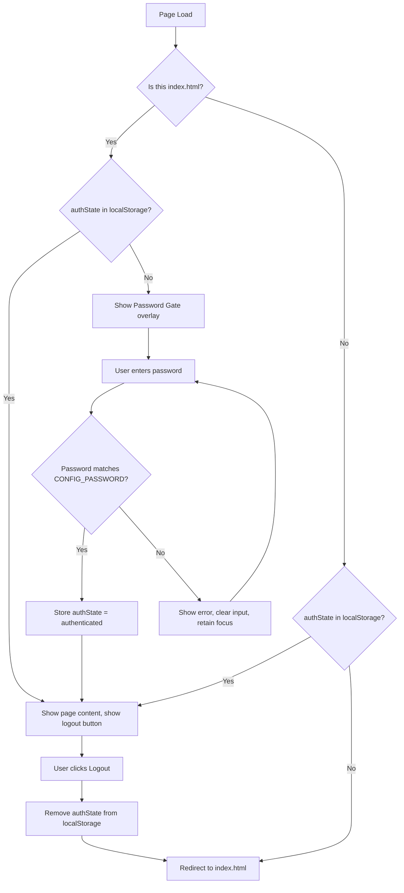
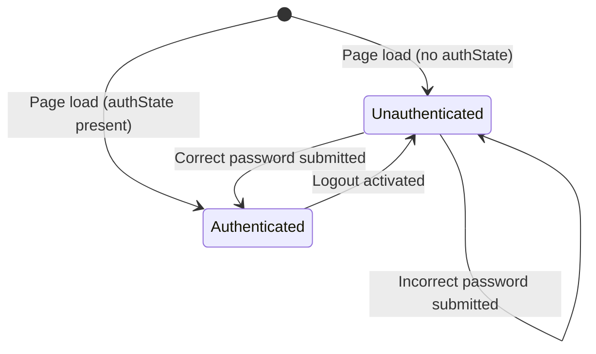

# Design Document: Password Protection

## Overview

This design adds a client-side password gate to the StartHobby application. Since the app is a static HTML/JS application with no backend, the password protection serves as a lightweight access barrier — not cryptographic security. The implementation uses a shared JavaScript module (`auth.js`) that defines the configured password constant and exposes authentication helper functions. Every HTML page includes this module and runs an auth check on load, either showing the password gate overlay (on `index.html`) or redirecting to `index.html` (on all other pages) when the user is not authenticated.

The design prioritizes:
- **Single source of truth**: One file (`auth.js`) contains the password constant and all auth logic
- **Minimal invasiveness**: Existing page functionality is untouched; the gate is an overlay that hides/shows
- **Accessibility**: Full WCAG 2.1 AA compliance with focus trapping, ARIA attributes, and keyboard operability
- **Consistency**: Uses existing patterns (global functions, localStorage via `getFromStorage`/`saveToStorage`, Tailwind CSS, Alpine.js)

## Architecture



### File Structure

```
├── auth.js              (NEW) Password constant + auth functions
├── index.html           (MODIFIED) Add gate overlay HTML + auth.js script
├── discovery.html       (MODIFIED) Add auth check redirect + logout button
├── my-plan.html         (MODIFIED) Add auth check redirect + logout button
├── progress.html        (MODIFIED) Add auth check redirect + logout button
├── avatar.html          (MODIFIED) Add auth check redirect + logout button
├── about.html           (MODIFIED) Add auth check redirect + logout button
├── onboarding.html      (MODIFIED) Add auth check redirect + logout button
├── hobby-detail.html    (MODIFIED) Add auth check redirect + logout button
└── utils.js             (UNCHANGED)
```

## Components and Interfaces

### 1. `auth.js` — Authentication Module

A new global script file that defines the password constant and exposes authentication functions. Loaded via `<script>` tag before other scripts on every page (same pattern as `utils.js`).

```javascript
/**
 * The single configured password for the application.
 * Change this value to update the password across all pages.
 * Must be a non-empty string between 4 and 128 characters.
 */
const APP_PASSWORD = 'starthobby2024';

/**
 * Checks if the configured password is valid.
 * @returns {boolean} True if APP_PASSWORD is a non-empty, non-whitespace string of 4-128 chars.
 */
function isPasswordConfigValid() { ... }

/**
 * Checks if the user is currently authenticated.
 * @returns {boolean} True if localStorage contains authState = "authenticated".
 */
function isAuthenticated() { ... }

/**
 * Validates a password attempt against the configured password.
 * Returns an object indicating success or failure with a reason.
 * @param {string} attempt - The password the user entered.
 * @returns {{ success: boolean, error?: string }}
 */
function validatePassword(attempt) { ... }

/**
 * Stores the authenticated state in localStorage.
 */
function setAuthenticated() { ... }

/**
 * Removes only the authState key from localStorage, preserving all other data.
 */
function logout() { ... }

/**
 * Runs the auth check appropriate for the current page.
 * - On index.html: shows/hides the password gate overlay
 * - On other pages: redirects to index.html if not authenticated
 * @param {boolean} isIndexPage - Whether the current page is index.html
 */
function runAuthCheck(isIndexPage) { ... }
```

### 2. Password Gate Overlay (HTML Component)

Added only to `index.html`. A full-screen overlay with `role="dialog"`, `aria-modal="true"`, and focus trapping.

```html
<!-- Password Gate Overlay -->
<div id="password-gate"
     role="dialog"
     aria-modal="true"
     aria-labelledby="gate-title"
     class="fixed inset-0 z-50 flex items-center justify-center bg-gray-900/80 backdrop-blur-sm"
     style="display: none;">
  <div class="bg-white rounded-2xl shadow-xl p-8 w-full max-w-sm mx-4">
    <h2 id="gate-title" class="text-xl font-bold text-gray-900 text-center">
      Password Required
    </h2>
    <p class="mt-2 text-sm text-gray-600 text-center">
      Enter the password to continue to StartHobby.
    </p>
    <form id="gate-form" class="mt-6" novalidate>
      <label for="gate-password" class="block text-sm font-medium text-gray-700 mb-1">
        Password
      </label>
      <input
        id="gate-password"
        type="password"
        maxlength="128"
        autocomplete="current-password"
        class="w-full px-4 py-2.5 border border-gray-300 rounded-lg focus:ring-2 focus:ring-brand-primary focus:border-brand-primary text-sm"
        placeholder="Enter password"
      />
      <div id="gate-error" aria-live="assertive" class="mt-2 text-sm text-red-600 min-h-[1.25rem]"></div>
      <button
        type="submit"
        class="mt-4 w-full px-4 py-2.5 bg-brand-primary text-white font-medium rounded-lg hover:bg-indigo-600 transition-colors text-sm"
      >
        Enter
      </button>
    </form>
  </div>
</div>
```

### 3. Logout Button (Navigation Addition)

Added to the navigation bar on every page, conditionally visible when authenticated. Placed next to the coin counter in the right-side nav area.

```html
<!-- Logout Button (shown only when authenticated) -->
<button
  id="logout-btn"
  onclick="handleLogout()"
  class="text-gray-500 hover:text-red-600 transition-colors p-2 rounded-lg hover:bg-red-50"
  aria-label="Logout"
  style="display: none;"
>
  <svg class="w-5 h-5" fill="none" stroke="currentColor" viewBox="0 0 24 24" aria-hidden="true">
    <path stroke-linecap="round" stroke-linejoin="round" stroke-width="2"
          d="M17 16l4-4m0 0l-4-4m4 4H7m6 4v1a3 3 0 01-3 3H6a3 3 0 01-3-3V7a3 3 0 013-3h4a3 3 0 013 3v1"/>
  </svg>
</button>
```

### 4. Auth Check on Non-Index Pages

Each non-index page includes a small inline script that runs before content renders:

```html
<script src="auth.js"></script>
<script>
  // Hide body content until auth check passes
  document.body.style.visibility = 'hidden';
  if (!isAuthenticated()) {
    window.location.replace('index.html');
  } else {
    document.body.style.visibility = 'visible';
  }
</script>
```

### 5. Focus Trap Implementation

The focus trap for the password gate cycles Tab/Shift+Tab among the gate's focusable elements (password input and submit button). Implemented as a `keydown` event listener on the gate overlay:

```javascript
function trapFocus(event) {
  if (event.key !== 'Tab') return;
  
  const focusableElements = gate.querySelectorAll(
    'input, button, [tabindex]:not([tabindex="-1"])'
  );
  const first = focusableElements[0];
  const last = focusableElements[focusableElements.length - 1];
  
  if (event.shiftKey && document.activeElement === first) {
    event.preventDefault();
    last.focus();
  } else if (!event.shiftKey && document.activeElement === last) {
    event.preventDefault();
    first.focus();
  }
}
```

## Data Models

### localStorage Schema

| Key | Type | Description |
|-----|------|-------------|
| `authState` | `string` | Value `"authenticated"` when user has passed the password gate. Absence means unauthenticated. |

### Authentication State Machine



### Function Signatures

| Function | Input | Output | Side Effects |
|----------|-------|--------|--------------|
| `isPasswordConfigValid()` | none | `boolean` | none |
| `isAuthenticated()` | none | `boolean` | none |
| `validatePassword(attempt)` | `string` | `{ success: boolean, error?: string }` | Stores authState on success |
| `setAuthenticated()` | none | `void` | Writes to localStorage |
| `logout()` | none | `void` | Removes authState from localStorage |
| `runAuthCheck(isIndexPage)` | `boolean` | `void` | Shows gate or redirects |

## Correctness Properties

*A property is a characteristic or behavior that should hold true across all valid executions of a system — essentially, a formal statement about what the system should do. Properties serve as the bridge between human-readable specifications and machine-verifiable correctness guarantees.*

### Property 1: Authentication round-trip

*For any* non-empty password string P where P equals the configured password (APP_PASSWORD), calling `validatePassword(P)` SHALL return `{ success: true }` and subsequently `isAuthenticated()` SHALL return `true`.

**Validates: Requirements 2.1, 2.2**

### Property 2: Incorrect password rejection

*For any* string P where P does NOT equal the configured password (APP_PASSWORD), calling `validatePassword(P)` SHALL return `{ success: false, error: <message> }` and `isAuthenticated()` SHALL remain `false` (localStorage unchanged).

**Validates: Requirements 2.3**

### Property 3: Password configuration validation

*For any* string S, `isPasswordConfigValid()` SHALL return `true` if and only if S is non-empty, not composed entirely of whitespace, and has length between 4 and 128 characters inclusive (where S is the value of APP_PASSWORD).

**Validates: Requirements 4.2**

### Property 4: Invalid configuration denial

*For any* password attempt string P, if the configured password (APP_PASSWORD) is undefined, empty, or composed entirely of whitespace, then `validatePassword(P)` SHALL return `{ success: false }` regardless of the value of P.

**Validates: Requirements 4.4**

### Property 5: Logout preserves user data

*For any* set of localStorage key-value pairs that includes `authState` and any combination of other application keys (hobbyUserProfile, coins, streak, savedHobbies, hobbyProgress, unlockedAchievements, avatarHistory), calling `logout()` SHALL remove only the `authState` key and all other keys SHALL retain their original values.

**Validates: Requirements 5.2**

## Error Handling

| Scenario | Behavior |
|----------|----------|
| Incorrect password submitted | Display inline error "Incorrect password. Please try again." below input. Clear input field. Retain focus on input. Error announced via `aria-live="assertive"`. |
| Password config is invalid (empty/whitespace/undefined) | Display error "Password is not configured. Please contact the administrator." All authentication attempts are denied. |
| localStorage unavailable or quota exceeded | Use existing `saveToStorage` error handling from `utils.js` which shows a warning toast. Auth check falls back to unauthenticated state (gate shown). |
| Password exceeds 128 characters | HTML `maxlength="128"` attribute prevents input beyond 128 chars. No additional JS validation needed. |
| User navigates to non-index page while unauthenticated | Immediate redirect to `index.html` via `window.location.replace()`. Page content hidden with `visibility: hidden` during check to prevent flash. |

## Testing Strategy

### Property-Based Tests (fast-check + Vitest)

Property-based testing is appropriate for this feature because the core authentication logic consists of pure functions with clear input/output behavior and universal properties that hold across a wide input space (all possible password strings).

**Library**: fast-check (already in devDependencies)
**Configuration**: Minimum 100 iterations per property test
**Tag format**: `Feature: password-protection, Property {number}: {property_text}`

Tests will be placed in `tests/auth.property.test.js` following the existing project pattern of evaluating the source file via `new Function()` with a mocked localStorage.

| Property | Test Description | Iterations |
|----------|-----------------|------------|
| 1 | Correct password → authenticated state stored | 100 |
| 2 | Non-matching password → validation fails, state unchanged | 100 |
| 3 | Config validation accepts valid passwords, rejects invalid | 100 |
| 4 | Invalid config → all attempts denied | 100 |
| 5 | Logout removes only authState, preserves other keys | 100 |

### Unit Tests (Example-Based)

Placed in `tests/auth.unit.test.js`:

- Gate is shown when authState is missing (Req 1.1)
- Gate is hidden when authState is present (Req 1.5, 3.1)
- Enter key triggers form submission (Req 2.5)
- Input cleared and focused after incorrect submission (Req 2.4)
- Redirect triggered on non-index page when unauthenticated (Req 3.3)
- Logout button visible when authenticated, hidden when not (Req 5.1, 5.4)
- Redirect to index.html after logout (Req 5.3)

### Accessibility Tests (Example-Based)

- `role="dialog"` and `aria-modal="true"` present on overlay (Req 6.6)
- Label `for`/`id` pairing on password input (Req 6.1)
- `aria-live="assertive"` on error region (Req 6.2)
- Focus moves to password input when gate appears (Req 6.3)
- Tab cycles only within gate elements (focus trap) (Req 6.5)

### Integration/Manual Testing

- Full page load flow: unauthenticated → gate → correct password → content visible
- Multi-page navigation: authenticate on index → navigate to other pages → content accessible
- Logout flow: click logout → redirected to index → gate shown → other pages redirect
- Visual consistency check with brand colors and Inter font
