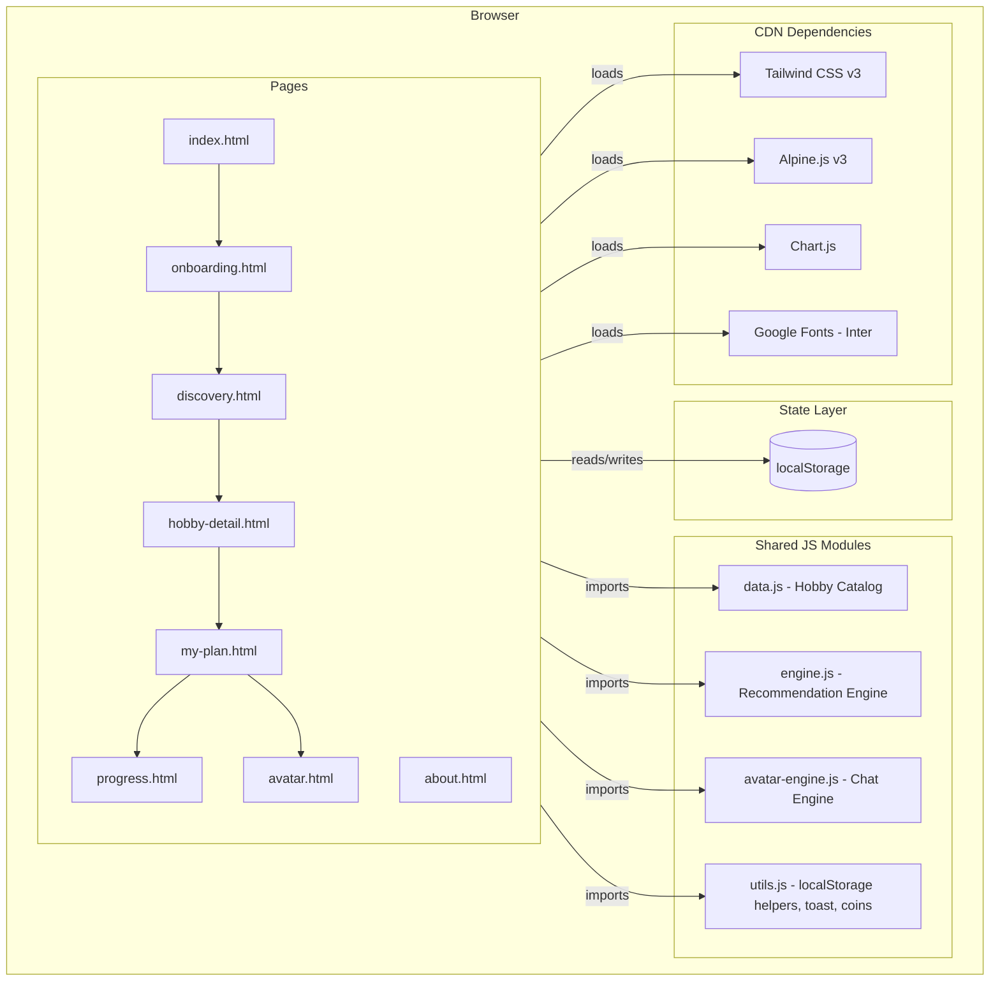
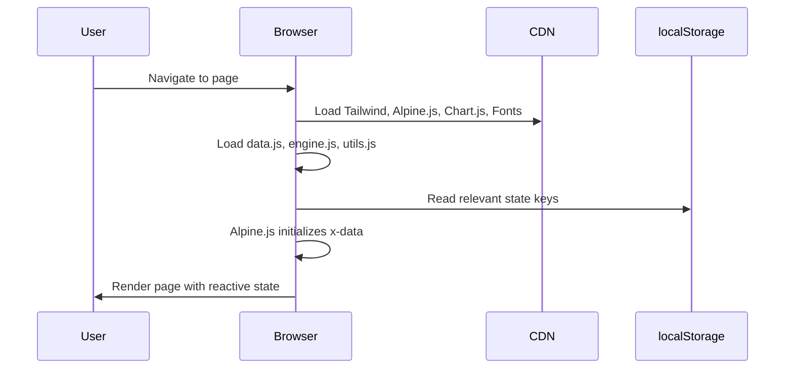
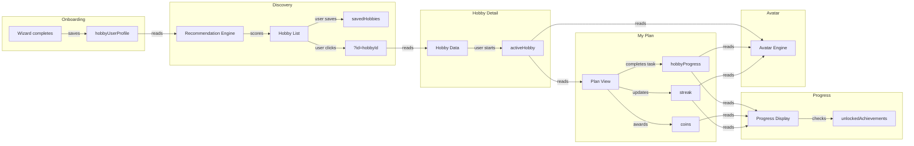

# Technical Design Document: StartHobby V1

## Overview

StartHobby V1 is a client-side multi-page HTML application that guides users through hobby discovery, onboarding, and structured beginner plans. The application uses no build toolchain — all pages are standalone `.html` files loading dependencies from CDN (Tailwind CSS, Alpine.js, Chart.js, Google Fonts). User state is persisted entirely in localStorage.

The architecture prioritizes simplicity: shared JavaScript modules (`data.js`, `engine.js`, `avatar-engine.js`, `utils.js`) are loaded via `<script>` tags, Alpine.js provides reactive state management within each page, and navigation between pages uses standard anchor links with query string parameters for context passing.

## Architecture

### High-Level Architecture



### Design Decisions

| Decision | Choice | Rationale |
|---|---|---|
| No build step | CDN-only dependencies | Simplicity, zero tooling setup, instant deployment |
| Multi-page vs SPA | Multi-page HTML | Each page is self-contained; no router needed; simpler mental model |
| State management | Alpine.js `x-data` + localStorage | Alpine handles reactive UI; localStorage persists across sessions |
| Data passing between pages | Query strings + localStorage | Hobby ID via `?id=`, user state via localStorage |
| Shared code | `<script src="...">` imports | Global functions available to all pages without module bundlers |

### Page Load Sequence



## Components and Interfaces

### File Structure

```
/hobby/
├── index.html            # Landing page
├── onboarding.html       # Multi-step wizard
├── discovery.html        # Filtered hobby results
├── hobby-detail.html     # Full hobby information
├── my-plan.html          # Daily task centre
├── progress.html         # Milestones, achievements, coins
├── avatar.html           # Coaching chat interface
├── about.html            # Mission and roadmap
├── data.js               # Hardcoded hobby catalog + achievements
├── engine.js             # Recommendation scoring + ranking
├── avatar-engine.js      # Keyword-match response engine
├── utils.js              # localStorage helpers, toast, coin logic, shared utilities
└── assets/
    ├── logo.svg
    └── illustrations/    # Hobby icon SVGs or PNG placeholders
```

### Shared JavaScript Modules

#### `data.js` — Hobby Catalog and Achievements

Exports global constants:
- `HOBBIES` — Array of 12+ hobby objects (see Data Models)
- `ACHIEVEMENTS` — Array of 8 achievement definitions
- `REWARDS` — Array of redeemable reward options

#### `engine.js` — Recommendation Engine

Exports global functions:
- `scoreHobby(hobby, profile)` → Number — Scores a single hobby against user profile
- `rankHobbies(hobbies, profile)` → Array — Returns filtered and sorted hobby list
- `getMatchReason(hobby, profile)` → String — Returns "Why this fits you" label

#### `avatar-engine.js` — Avatar Response Engine

Exports global functions:
- `getAvatarResponse(userInput, profile, plan)` → `{ text: String, chips: String[] }` — Matches input to scripted flows
- `getGreeting(profile, plan)` → `{ text: String, chips: String[] }` — Returns initial greeting

#### `utils.js` — Shared Utilities

Exports global functions:
- `getFromStorage(key, defaultValue)` → any — Safe localStorage read with fallback
- `saveToStorage(key, value)` → void — localStorage write with JSON serialization
- `addCoins(amount)` → Number — Adds coins, persists, returns new total
- `deductCoins(amount)` → Boolean — Deducts if sufficient, returns success
- `getStreak()` → `{ current, best, lastActiveDate }` — Reads streak state
- `updateStreak(completed)` → Object — Updates streak based on completion
- `showToast(message, type)` → void — Displays auto-dismissing toast notification
- `checkAchievements()` → Array — Checks all thresholds, unlocks new achievements
- `getActiveHobbyPlan()` → Object|null — Returns active hobby + today's task info

### Shared UI Components

Each page includes these components via inline HTML + Alpine.js patterns:

#### Navigation Bar

```html
<!-- Included at top of every page -->
<nav x-data="{ mobileOpen: false }" class="...">
  <!-- Logo left, links centre, CTA + coin counter right -->
  <!-- Mobile: hamburger toggles mobileOpen -->
</nav>
```

- Reads `coins` from localStorage on init
- Listens for `storage` events to update reactively
- Active page determined by comparing `window.location.pathname`

#### Toast Notification System

```html
<!-- Included in every page body -->
<div x-data="toastStore()" x-on:show-toast.window="add($event.detail)" class="fixed top-4 right-4 z-50">
  <template x-for="toast in toasts" :key="toast.id">
    <div x-show="toast.visible" x-transition class="...">
      <span x-text="toast.message"></span>
    </div>
  </template>
</div>
```

Triggered via: `window.dispatchEvent(new CustomEvent('show-toast', { detail: { message, type } }))`

#### Skeleton Loader

CSS-animated pulse placeholder shown for 600ms on Discovery and My Plan pages:

```html
<div x-show="loading" class="animate-pulse">
  <!-- Grey block placeholders matching card layout -->
</div>
```

#### Modal / Confirmation Dialog

```html
<div x-show="modalOpen" class="fixed inset-0 z-50 flex items-center justify-center">
  <div class="absolute inset-0 bg-black/50" @click="modalOpen = false"></div>
  <div class="relative bg-white rounded-xl p-6 max-w-md" x-transition>
    <!-- Modal content -->
  </div>
</div>
```

### Alpine.js State Management Patterns

Each page uses a single `x-data` object on the `<body>` or a wrapper `<div>` that encapsulates all page state:

```javascript
// Pattern: Page-level state initialization
function pageInit() {
  return {
    // State
    loading: true,
    data: [],
    
    // Lifecycle
    init() {
      // Read from localStorage
      // Set up reactive state
      setTimeout(() => this.loading = false, 600);
    },
    
    // Actions
    handleAction() {
      // Modify state
      // Persist to localStorage
      // Trigger toast
    }
  }
}
```

**Cross-page communication** is achieved exclusively through localStorage:
1. Page A writes state to localStorage
2. User navigates to Page B
3. Page B reads state from localStorage on `init()`

### Data Flow Between Pages



## Data Models

### Hobby Object

```javascript
{
  id: String,                    // kebab-case identifier, e.g. "watercolour-painting"
  name: String,                  // Display name
  category: String,              // "Art" | "Music" | "Fitness" | "Outdoor" | "Creative" | "Craft" | "Strategy" | "Wellbeing"
  tags: String[],                // Searchable tags for goal matching
  difficulty: String,            // "beginner" | "intermediate" | "advanced"
  timePerWeek: { min: Number, max: Number },  // Hours per week
  starterCost: { min: Number, max: Number },  // USD
  environment: String,           // "indoor" | "outdoor" | "both"
  social: String,                // "solo" | "social" | "either"
  spaceNeeded: String,           // "small" | "room" | "yard" | "outside"
  timeToFirstWin: String,        // Human-readable, e.g. "1 week"
  description: String,           // 2-3 sentence overview
  equipment: [{
    item: String,
    required: Boolean,
    cost: Number,
    alternative: String
  }],
  safetyNotes: String[],
  commonPitfalls: [{ issue: String, fix: String }],
  weekOnePlan: [{
    day: Number,                 // 1-7
    title: String,
    description: String,
    estimatedTime: String,
    coins: Number                // Coins awarded on completion
  }],
  milestones: [{
    label: String,
    timeframe: String,
    description: String
  }],
  resources: {
    videos: [{ title: String, url: String, duration: String, level: String, source: String }],
    articles: [{ title: String, url: String, duration: String, level: String, source: String }],
    communities: [{ title: String, url: String, members: String, platform: String }]
  },
  matchScore: Number | null      // Computed at runtime
}
```

### User Profile Object (localStorage: `hobbyUserProfile`)

```javascript
{
  time: String,       // "<2hrs" | "2-5hrs" | "5-10hrs" | "10+hrs"
  budget: String,     // "free" | "<$50" | "$50-$150" | "$150+"
  env: String,        // "indoor" | "outdoor" | "both"
  social: String,     // "solo" | "with-others" | "either"
  space: String,      // "small" | "room" | "yard" | "outside"
  learning: String[], // ["videos", "guides", "tasks", "try-first"]
  goals: String[],    // ["relax", "creative", "fit", "meet-people", "build-skill", "fun"]
  name: String        // Optional user name
}
```

### Hobby Progress Object (localStorage: `hobbyProgress`)

```javascript
{
  [hobbyId]: {
    completedDays: Number[],     // Array of day numbers (1-7) completed
    skippedDays: Number[],       // Array of day numbers skipped
    notes: {
      [dayNumber]: String        // User notes per day
    },
    startDate: String,           // ISO date string
    weekNumber: Number           // Current week in plan
  }
}
```

### Streak Object (localStorage: `streak`)

```javascript
{
  current: Number,          // Current consecutive days
  best: Number,             // All-time best streak
  lastActiveDate: String    // ISO date of last activity, e.g. "2026-05-21"
}
```

### Achievement Definition

```javascript
{
  id: String,               // Unique identifier
  name: String,             // Display name
  icon: String,             // Emoji icon
  description: String,      // What the user did to earn it
  // Threshold conditions (only one applies per achievement):
  daysThreshold: Number | null,
  streakThreshold: Number | null,
  coinThreshold: Number | null,
  savedThreshold: Number | null,
  milestoneId: String | null,
  trigger: String | null     // Special event trigger, e.g. "plan-started"
}
```

### Reward Definition

```javascript
{
  id: String,
  name: String,
  description: String,
  coinCost: Number,
  icon: String
}
```

### localStorage Key Map

| Key | Type | Default |
|---|---|---|
| `hobbyUserProfile` | Object | `null` |
| `savedHobbies` | String[] | `[]` |
| `activeHobby` | String | `null` |
| `hobbyProgress` | Object | `{}` |
| `coins` | Number | `0` |
| `streak` | Object | `{ current: 0, best: 0, lastActiveDate: null }` |
| `unlockedAchievements` | String[] | `[]` |
| `avatarHistory` | Array | `[]` |


## Correctness Properties

*A property is a characteristic or behavior that should hold true across all valid executions of a system — essentially, a formal statement about what the system should do. Properties serve as the bridge between human-readable specifications and machine-verifiable correctness guarantees.*

### Property 1: Hard filter exclusion

*For any* hobby and any user profile, if the hobby violates any hard filter constraint (budget exceeds hobby cost, time insufficient, environment mismatch where neither is "both", or social mismatch where neither is "either"), then `scoreHobby(hobby, profile)` SHALL return exactly 0.

**Validates: Requirements 9.1, 9.2, 9.3, 9.4, 9.5, 3.3**

### Property 2: Soft score composition

*For any* hobby and any user profile where no hard filter is violated, `scoreHobby(hobby, profile)` SHALL return a score equal to the sum of: 20 (if beginner) + 30 (if any tag matches a goal) + 10 (if exact environment match) + 10 (if exact social match) + 10 (if exact space match) + 10 (if starter cost is zero).

**Validates: Requirements 9.6, 9.7, 9.8**

### Property 3: Ranking output invariants

*For any* array of hobbies and any valid user profile, `rankHobbies(hobbies, profile)` SHALL return a list that is (a) sorted in descending order by matchScore, (b) contains no hobbies with a score of zero, and (c) contains only hobbies from the original input array.

**Validates: Requirements 3.2, 9.9**

### Property 4: Avatar keyword matching

*For any* user input string containing at least one trigger keyword from a defined flow, `getAvatarResponse(input, profile, plan)` SHALL return the response from the first matching flow (not the fallback). Conversely, for any input string containing none of the defined trigger keywords, the function SHALL return the fallback response.

**Validates: Requirements 7.4, 7.5, 7.6, 7.7, 7.8**

### Property 5: Coin award additivity

*For any* starting coin balance and any coin-awarding action (task completion: 30, save hobby: 5, write note: 10), calling `addCoins(amount)` SHALL result in the new balance equaling the previous balance plus the specified amount, and the result SHALL be persisted to localStorage.

**Validates: Requirements 10.1, 10.4, 10.6, 10.7**

### Property 6: Coin redemption correctness

*For any* coin balance and any reward with a coin cost, if balance >= cost then `deductCoins(cost)` SHALL return true and the new balance SHALL equal balance minus cost. If balance < cost then `deductCoins(cost)` SHALL return false and the balance SHALL remain unchanged.

**Validates: Requirements 6.7, 6.8, 10.8**

### Property 7: Save toggle idempotence

*For any* hobby ID and any initial saved state, toggling the save state twice SHALL return the `savedHobbies` array to its original state (same elements, same length).

**Validates: Requirements 3.7**

### Property 8: Streak skip logic

*For any* week state, if the number of skipped days in the current week is 0 or 1, then skipping a day SHALL NOT reset the streak (current streak remains unchanged). If the number of skipped days is already 2 or more, then skipping SHALL reset the current streak to 0.

**Validates: Requirements 5.6, 5.7**

### Property 9: Onboarding persistence round-trip

*For any* valid set of onboarding answers (valid time, budget, environment, social, space, learning styles, goals, and name), saving to localStorage and reading back SHALL produce an object equivalent to the original answers.

**Validates: Requirements 2.7, 13.3**

### Property 10: Achievement unlock threshold

*For any* achievement definition and any user state, if the user's state meets or exceeds the achievement's threshold condition (days >= daysThreshold, streak >= streakThreshold, coins >= coinThreshold, saved >= savedThreshold), then `checkAchievements()` SHALL include that achievement's ID in the unlocked list.

**Validates: Requirements 6.5**

### Property 11: localStorage corruption resilience

*For any* localStorage key used by the application, if the stored value is missing, null, undefined, or contains invalid JSON, then `getFromStorage(key, defaultValue)` SHALL return the specified default value without throwing an exception.

**Validates: Requirements 13.4**

### Property 12: Chat history persistence round-trip

*For any* array of chat message objects, saving to localStorage under `avatarHistory` and reading back SHALL produce an equivalent array with all messages preserved in order.

**Validates: Requirements 7.10**

## Error Handling

### localStorage Errors

| Scenario | Handling |
|---|---|
| Key missing | Return default value (empty array, 0, null as appropriate) |
| Invalid JSON | Catch parse error, return default, optionally clear corrupted key |
| Storage full | Catch QuotaExceededError, show warning toast, do not crash |
| Private browsing (no storage) | Graceful degradation — app works for session but state not persisted |

### Page Load Errors

| Scenario | Handling |
|---|---|
| Missing query param on hobby-detail.html | Redirect to discovery.html with info toast |
| No active hobby on my-plan.html | Show "Choose a hobby first" message with CTA to discovery |
| No user profile on discovery.html | Redirect to onboarding.html |
| CDN script fails to load | Page degrades gracefully; Tailwind fallback styles in `<style>` block |

### Avatar Engine Errors

| Scenario | Handling |
|---|---|
| Empty input submitted | Ignore (don't append empty bubble) |
| Profile or plan data missing | Avatar returns generic greeting without personalization |
| Extremely long input | Truncate to 500 characters before processing |

### Coin System Errors

| Scenario | Handling |
|---|---|
| Negative coin balance (should never happen) | Clamp to 0, log warning |
| Redemption race condition (double-click) | Disable button after first click until operation completes |
| NaN coin value in storage | Reset to 0 |

## Testing Strategy

### Approach

The testing strategy uses a dual approach:

1. **Property-based tests** — Validate universal correctness properties (Properties 1–12) using generated inputs across 100+ iterations per property
2. **Example-based unit tests** — Verify specific UI behaviors, edge cases, and integration points with concrete examples

### Property-Based Testing

**Library:** [fast-check](https://github.com/dubzzz/fast-check) (JavaScript property-based testing library)

**Configuration:**
- Minimum 100 iterations per property test
- Each test tagged with: `Feature: starthobby-v1, Property N: [title]`
- Tests target pure functions in `engine.js`, `avatar-engine.js`, and `utils.js`

**Test File Structure:**
```
/hobby/
├── tests/
│   ├── engine.property.test.js      # Properties 1, 2, 3
│   ├── avatar.property.test.js      # Property 4
│   ├── coins.property.test.js       # Properties 5, 6
│   ├── state.property.test.js       # Properties 7, 8, 9, 11, 12
│   └── achievements.property.test.js # Property 10
```

**Generators needed:**
- `arbitraryHobby()` — Generates valid hobby objects with random attributes
- `arbitraryProfile()` — Generates valid user profiles with random preferences
- `arbitraryCoinBalance()` — Non-negative integers
- `arbitraryReward()` — Reward objects with random coin costs
- `arbitraryChatMessage()` — Chat message objects
- `arbitraryWeekState()` — Week progress with random completed/skipped days

### Example-Based Unit Tests

**Library:** Vitest (lightweight, fast, works without complex setup)

**Coverage areas:**
- Page initialization and rendering (DOM checks)
- Navigation and routing behavior
- UI interactions (click handlers, form validation)
- Responsive breakpoint behavior
- Accessibility attributes (ARIA labels, alt text, focus management)
- Toast notification display and dismissal
- Skeleton loader timing

### Integration Tests

- Full onboarding flow: complete all 8 steps → verify localStorage state
- Discovery flow: load with profile → verify ranked results display
- Plan completion flow: mark tasks → verify coins, streak, achievements update
- Avatar conversation: send messages → verify correct responses appear

### Test Runner

Vitest with `--run` flag for single execution (no watch mode). Tests run in jsdom environment for DOM access.

```bash
npx vitest --run
```
