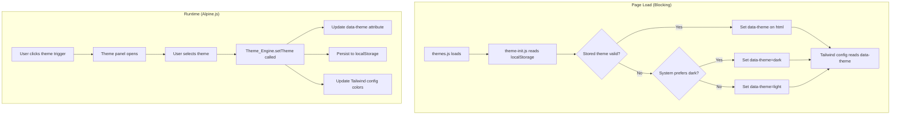

# Design Document: UI Theme Switcher

## Overview

The UI Theme Switcher adds multi-theme support to the StartHobby application, allowing users to switch between Light, Dark, and "Indigo Night" visual themes. The feature integrates with the existing static HTML/JS architecture using Tailwind CSS (CDN), Alpine.js for interactivity, and localStorage for persistence (via the existing `saveToStorage`/`getFromStorage` helpers in `utils.js`).

The design prioritizes:
- **Zero flash**: Theme is resolved and applied synchronously in `<head>` before body renders
- **Extensibility**: Themes are defined as structured configuration objects in a dedicated `themes.js` file; adding a new theme requires no changes to application logic
- **Accessibility**: The theme switcher implements WAI-ARIA radiogroup pattern with full keyboard navigation and roving tabindex
- **Consistency**: A single theme engine applies the active theme identically across all 8 application pages

## Architecture



### Key Architectural Decisions

1. **CSS Custom Properties via `data-theme` attribute**: Rather than toggling individual Tailwind classes across all elements, the theme engine sets a `data-theme` attribute on `<html>` and extends the Tailwind CDN config to resolve color tokens from CSS custom properties. This means a single attribute change repaints the entire page.

2. **Synchronous blocking script in `<head>`**: A small inline script (`theme-init.js` logic inlined) runs before body parse, reading localStorage and setting `data-theme` + CSS custom properties. This prevents any flash of incorrect theme (FOIT).

3. **Separation of concerns**: `themes.js` holds only theme definitions (data). `theme-engine.js` holds the application logic (reading, validating, applying, persisting). The Alpine.js component in the nav handles UI interaction only.

4. **Tailwind CDN config extension**: The existing `tailwind.config` block in each page's `<head>` is extended to map semantic color tokens (e.g., `bg-surface`, `text-primary`) to CSS custom properties that change with the active theme.

## Components and Interfaces

### 1. `themes.js` — Theme Definitions

A script loaded via `<script>` tag that exposes a global `THEMES` array. Each theme object follows a strict schema.

```javascript
// Global: window.THEMES
const THEMES = [
  {
    id: 'light',
    name: 'Light',
    colorMap: {
      background: '#ffffff',
      surface: '#f9fafb',       // gray-50
      'text-primary': '#111827', // gray-900
      'text-secondary': '#6b7280', // gray-500
      'brand-primary': '#6366f1', // indigo-500
      'brand-secondary': '#10b981', // emerald-500
      border: '#e5e7eb'          // gray-200
    }
  },
  {
    id: 'dark',
    name: 'Dark',
    colorMap: {
      background: '#111827',     // gray-900
      surface: '#1f2937',        // gray-800
      'text-primary': '#f3f4f6', // gray-100
      'text-secondary': '#9ca3af', // gray-400
      'brand-primary': '#6366f1', // indigo-500
      'brand-secondary': '#34d399', // emerald-400
      border: '#374151'          // gray-700
    }
  },
  {
    id: 'indigo-night',
    name: 'Indigo Night',
    colorMap: {
      background: '#1e1b4b',     // indigo-950
      surface: '#312e81',        // indigo-900
      'text-primary': '#e0e7ff', // indigo-100
      'text-secondary': '#a5b4fc', // indigo-300
      'brand-primary': '#818cf8', // indigo-400
      'brand-secondary': '#34d399', // emerald-400
      border: '#4338ca'          // indigo-700
    }
  }
];
```

### 2. `theme-engine.js` — Theme Application Logic

Exposes global functions for theme management:

```javascript
/**
 * Validates a theme object has all required properties.
 * @param {Object} theme - Theme object to validate.
 * @returns {boolean} True if valid, false otherwise.
 */
function isValidTheme(theme) { ... }

/**
 * Returns the array of valid themes from the THEMES global,
 * filtering out any malformed entries.
 * @returns {Array} Array of valid theme objects.
 */
function getValidThemes() { ... }

/**
 * Resolves the active theme ID using the priority:
 * 1. Stored value in localStorage (if valid)
 * 2. System preference (prefers-color-scheme: dark → 'dark')
 * 3. Default: 'light'
 * @returns {string} The resolved theme ID.
 */
function resolveThemeId() { ... }

/**
 * Applies a theme by ID: sets data-theme on <html>,
 * updates CSS custom properties, and updates Tailwind config.
 * @param {string} themeId - The theme identifier to apply.
 */
function applyTheme(themeId) { ... }

/**
 * Sets the active theme: applies it and persists to localStorage.
 * If themeId is already active, does nothing.
 * @param {string} themeId - The theme identifier to set.
 */
function setTheme(themeId) { ... }

/**
 * Returns the currently active theme ID from the <html> data-theme attribute.
 * @returns {string} The active theme ID.
 */
function getActiveThemeId() { ... }
```

### 3. Theme Initialization (Inline `<head>` Script)

A small synchronous script inlined in each page's `<head>`, after `themes.js` loads:

```javascript
(function() {
  var stored = null;
  try { stored = JSON.parse(localStorage.getItem('sh_theme')); } catch(e) {}
  var validIds = THEMES.filter(function(t) { return t && t.id && t.colorMap; }).map(function(t) { return t.id; });
  var themeId;
  if (stored && validIds.indexOf(stored) !== -1) {
    themeId = stored;
  } else {
    if (stored !== null) { try { localStorage.removeItem('sh_theme'); } catch(e) {} }
    themeId = (window.matchMedia && window.matchMedia('(prefers-color-scheme: dark)').matches) ? 'dark' : 'light';
  }
  document.documentElement.setAttribute('data-theme', themeId);
  // Set CSS custom properties immediately
  var theme = THEMES.find(function(t) { return t.id === themeId; });
  if (theme && theme.colorMap) {
    Object.keys(theme.colorMap).forEach(function(key) {
      document.documentElement.style.setProperty('--theme-' + key, theme.colorMap[key]);
    });
  }
})();
```

### 4. Theme Switcher UI Component (Alpine.js)

An Alpine.js component rendered in the navigation bar that provides the trigger button and theme selection panel:

```javascript
function themeSwitcher() {
  return {
    open: false,
    activeTheme: '',
    themes: [],
    focusedIndex: 0,

    init() {
      this.themes = getValidThemes();
      this.activeTheme = getActiveThemeId();
      this.focusedIndex = this.themes.findIndex(t => t.id === this.activeTheme);
      if (this.focusedIndex === -1) this.focusedIndex = 0;
    },

    toggle() { this.open = !this.open; },

    select(themeId) {
      if (themeId === this.activeTheme) return;
      setTheme(themeId);
      this.activeTheme = themeId;
    },

    handleKeydown(event) { /* Arrow key navigation, Enter/Space selection */ },

    close() { this.open = false; }
  };
}
```

### 5. Tailwind CSS Configuration Extension

The existing `tailwind.config` in each page's `<head>` is extended to use CSS custom properties:

```javascript
tailwind.config = {
  theme: {
    extend: {
      fontFamily: { sans: ['Inter', 'system-ui', 'sans-serif'] },
      colors: {
        brand: {
          primary: 'var(--theme-brand-primary, #6366f1)',
          secondary: 'var(--theme-brand-secondary, #10b981)'
        },
        surface: 'var(--theme-surface, #f9fafb)',
        'th-bg': 'var(--theme-background, #ffffff)',
        'th-text': 'var(--theme-text-primary, #111827)',
        'th-text-secondary': 'var(--theme-text-secondary, #6b7280)',
        'th-border': 'var(--theme-border, #e5e7eb)'
      }
    }
  }
}
```

## Data Models

### Theme Object Schema

| Property | Type | Constraints | Description |
|----------|------|-------------|-------------|
| `id` | `string` | 1–50 chars, unique | Machine-readable identifier |
| `name` | `string` | 1–100 chars | Human-readable display name |
| `colorMap` | `object` | Exactly 7 keys | Color definitions for the theme |
| `colorMap.background` | `string` | Valid CSS color | Page background color |
| `colorMap.surface` | `string` | Valid CSS color | Card/surface background color |
| `colorMap.text-primary` | `string` | Valid CSS color | Primary text color |
| `colorMap.text-secondary` | `string` | Valid CSS color | Secondary/muted text color |
| `colorMap.brand-primary` | `string` | Valid CSS color | Brand accent color |
| `colorMap.brand-secondary` | `string` | Valid CSS color | Secondary brand color |
| `colorMap.border` | `string` | Valid CSS color | Border/divider color |

### localStorage Keys

| Key | Type | Description |
|-----|------|-------------|
| `sh_theme` | `string` (JSON) | Stored theme identifier (e.g., `"dark"`) |

### Required Color Map Keys (Constant)

```javascript
const REQUIRED_COLOR_KEYS = [
  'background', 'surface', 'text-primary', 'text-secondary',
  'brand-primary', 'brand-secondary', 'border'
];
```

## Correctness Properties

*A property is a characteristic or behavior that should hold true across all valid executions of a system — essentially, a formal statement about what the system should do. Properties serve as the bridge between human-readable specifications and machine-verifiable correctness guarantees.*

### Property 1: Theme persistence round-trip

*For any* valid theme ID from the THEMES configuration, calling `setTheme(id)` and then `resolveThemeId()` SHALL return that same theme ID, regardless of the current system color scheme preference.

**Validates: Requirements 2.1, 2.2, 3.3**

### Property 2: Invalid theme ID fallback and cleanup

*For any* string that is not a valid theme ID in the THEMES configuration, if that string is stored in localStorage as the theme preference, then `resolveThemeId()` SHALL return either 'light' or 'dark' (based on system preference), and the invalid value SHALL be removed from localStorage.

**Validates: Requirements 2.4, 5.4**

### Property 3: Theme application sets all CSS custom properties

*For any* valid theme object from the THEMES configuration, calling `applyTheme(theme.id)` SHALL result in exactly 7 CSS custom properties (`--theme-background`, `--theme-surface`, `--theme-text-primary`, `--theme-text-secondary`, `--theme-brand-primary`, `--theme-brand-secondary`, `--theme-border`) being set on the document element, with values matching the theme's colorMap.

**Validates: Requirements 4.1, 4.3**

### Property 4: setTheme idempotence

*For any* valid theme ID, calling `setTheme(id)` when that theme is already active SHALL produce no change to the DOM attributes, CSS custom properties, or localStorage state (i.e., `setTheme` is idempotent).

**Validates: Requirements 1.5**

### Property 5: Theme validation correctness

*For any* JavaScript object, `isValidTheme(obj)` SHALL return `true` if and only if the object has a string `id` (1–50 characters), a string `name` (1–100 characters), and a `colorMap` object containing exactly the 7 required keys (`background`, `surface`, `text-primary`, `text-secondary`, `brand-primary`, `brand-secondary`, `border`) where each value is a non-empty string.

**Validates: Requirements 9.1**

### Property 6: getValidThemes filtering

*For any* array of theme-like objects (some valid, some invalid), `getValidThemes()` SHALL return exactly those objects that pass `isValidTheme()` validation, preserving their order, and excluding all invalid entries.

**Validates: Requirements 9.3, 9.4**

### Property 7: Keyboard navigation wrapping

*For any* number of themes N (≥ 1) and any currently focused index, pressing Arrow Down/Right SHALL move focus to `(index + 1) % N`, and pressing Arrow Up/Left SHALL move focus to `(index - 1 + N) % N`, implementing circular navigation.

**Validates: Requirements 6.1**

### Property 8: ARIA and tabindex state consistency

*For any* set of valid themes and any selected theme index, exactly one theme option SHALL have `aria-checked="true"` and `tabindex="0"`, and all other theme options SHALL have `aria-checked="false"` and `tabindex="-1"`.

**Validates: Requirements 6.3, 6.5**

### Property 9: WCAG AA contrast ratios

*For any* theme in the THEMES configuration, the contrast ratio between `text-primary` and `background` SHALL be at least 4.5:1, the contrast ratio between `text-primary` and `surface` SHALL be at least 4.5:1, and the contrast ratio between `brand-primary` and `background` SHALL be at least 3:1.

**Validates: Requirements 8.2, 8.4**

## Error Handling

| Scenario | Behavior |
|----------|----------|
| localStorage read throws | Fall back to system preference or 'light' default; no error shown to user |
| localStorage write throws (QuotaExceededError) | Show warning toast via existing `showToast()` helper; theme still applies to current page |
| Stored theme ID not in THEMES | Remove invalid value from localStorage; fall back to 'light' or system preference |
| `themes.js` fails to load | Init script uses empty THEMES array; falls back to 'light' with hardcoded CSS values |
| Theme object missing required properties | `isValidTheme()` returns false; theme excluded from switcher UI |
| `matchMedia` not supported | Treat system preference as unavailable; default to 'light' |

## Testing Strategy

### Property-Based Tests (fast-check + Vitest)

The project already uses `fast-check` with Vitest for property-based testing. Each correctness property above maps to one or more property-based tests.

**Configuration:**
- Library: `fast-check` (already in devDependencies)
- Runner: `vitest --run` (already configured)
- Environment: `jsdom` (already configured in vitest.config.js)
- Minimum iterations: 100 per property test
- Tag format: `Feature: ui-theme-switcher, Property {N}: {title}`

**Test file:** `tests/theme.property.test.js`

**Generators needed:**
- `arbitraryThemeId()` — generates valid theme IDs from the THEMES array
- `arbitraryInvalidThemeId()` — generates strings that are NOT valid theme IDs
- `arbitraryThemeObject()` — generates valid theme objects with random colors
- `arbitraryInvalidThemeObject()` — generates objects missing required properties
- `arbitraryFocusedIndex(n)` — generates integers in [0, n-1]
- `arbitraryArrowKey()` — generates 'ArrowUp', 'ArrowDown', 'ArrowLeft', 'ArrowRight'

### Unit Tests (Example-Based)

**Test file:** `tests/theme.unit.test.js`

Cover specific examples and edge cases:
- Default themes (light, dark, indigo-night) are present and valid
- System preference detection returns correct default
- Theme switcher renders correct ARIA attributes
- Trigger button has correct aria-label
- Color preview swatches render for each theme
- Active theme indicator (border/checkmark) is visible

### Integration Considerations

- Verify `themes.js` script tag is present in all 8 HTML pages
- Verify inline init script is in `<head>` before body content
- Verify `theme-engine.js` is loaded after `themes.js`
- Manual testing: verify no flash of incorrect theme on page load across browsers

